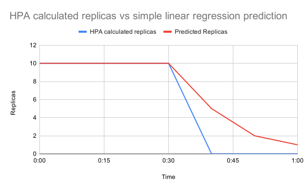

Here is the updated and translated `docs/user-guide/getting-started.md` for your repository, including the instructions for setting up Kubernetes using Docker Desktop instead of k3d:

---

# Başlarken

Bu kılavuz, basit bir Tahminsel Yatay Pod Ölçeklendirici (PHPA) dağıtmanın ilk adımlarını gösterecektir. Bu kılavuz, CPU kullanımına dayalı olarak gelecekteki yükü tahmin etmek için lineer regresyon kullanan bir PHPA'nın nasıl dağıtılacağını gösterecektir.

Bu kılavuzun nihai sonucunu görmek için [Basit Lineer Regresyon
örneğine](https://github.com/jthomperoo/predictive-horizontal-pod-autoscaler/tree/master/examples/simple-linear) göz atın.

## Ön Koşullar

Bu kılavuz aşağıdaki araçların kurulu olmasını gerektirir:

- [kubectl](https://kubernetes.io/docs/tasks/tools/#kubectl) == `v1`
- [helm](https://helm.sh/docs/intro/install/) == `v3`
- [Docker Desktop](https://www.docker.com/products/docker-desktop) == `v4`
- [jq](https://stedolan.github.io/jq/) >= `v1.6`

## Küme Kurulumu

Bu kılavuz, yerel bir Kubernetes sunucusu sağlamak için [Docker Desktop](https://www.docker.com/products/docker-desktop) kullanır, ancak herhangi bir Kubernetes sunucusunu kullanabilirsiniz (zaten bir tane kurulmuş olabilir). Eğer zaten bir Kubernetes sunucusu metrik sunucusu etkinleştirilmiş olarak yapılandırılmışsa, bu adımı atlayıp bir sonraki adıma geçin.

Docker Desktop ile bir Kubernetes kümesi kurmak için şu adımları izleyin:

1. Docker Desktop'u açın ve ayarları açın.
2. "Kubernetes" sekmesine gidin.
3. "Enable Kubernetes" seçeneğini işaretleyin.
4. "Apply & Restart" düğmesine tıklayın.

## Predictive Horizontal Pod Autoscaler Operatörünü Kümenize Yükleyin

PHPAs yüklemek için öncelikle PHPA operatörünün kümenize yüklenmiş olması gerekmektedir.

Bu kılavuzda `v0.13.2` sürümünü kullanıyoruz, ancak daha yeni sürümler için [kurulum kılavuzuna](./installation.md) göz atın.

PHPA operatörünü yüklemek için aşağıdaki komutları çalıştırın:

```bash
VERSION=v0.13.2
HELM_CHART=predictive-horizontal-pod-autoscaler-operator
helm install ${HELM_CHART} https://github.com/jthomperoo/predictive-horizontal-pod-autoscaler/releases/download/${VERSION}/predictive-horizontal-pod-autoscaler-${VERSION}.tgz
```

PHPA operatörünün düzgün bir şekilde dağıtıldığını kontrol etmek için şu komutu çalıştırabilirsiniz:

```bash
helm status predictive-horizontal-pod-autoscaler-operator
```

Aşağıdaki gibi bir yanıt almalısınız:

```bash
NAME: predictive-horizontal-pod-autoscaler-operator
LAST DEPLOYED: Thu Jul 21 20:29:06 2022
NAMESPACE: default
STATUS: deployed
REVISION: 1
TEST SUITE: None
NOTES:
Thanks for installing predictive-horizontal-pod-autoscaler.
```

Eğer "release not found" şeklinde bir yanıt alırsanız, kurulum doğru çalışmamış demektir.

## Otomatik Ölçeklendirme İçin Bir Dağıtım Oluşturun

Şimdi, yük temelinde yukarı ve aşağı ölçeklenecek bir test uygulaması oluşturmanız gerekiyor. Bu kılavuzda, Yatay Pod Ölçeklendirici'yi test etmek için Kubernetes dokümantasyonunda sağlanan bir örnek konteyneri kullanıyoruz; test uygulaması, kendisine gönderilen her talebe `OK!` yanıtı verecektir. Bu, uygulamaya gönderdiğimiz istek sayısını ayarlayarak daha büyük ve daha küçük yükleri simüle etmemizi sağlar.

`deployment.yaml` adında yeni bir dosya oluşturun ve aşağıdaki YAML'ı dosyaya kopyalayın:

```yaml
apiVersion: apps/v1
kind: Deployment
metadata:
  labels:
    run: php-apache
  name: php-apache
spec:
  replicas: 1
  selector:
    matchLabels:
      run: php-apache
  template:
    metadata:
      labels:
        run: php-apache
    spec:
      containers:
      - image: k8s.gcr.io/hpa-example
        imagePullPolicy: Always
        name: php-apache
        ports:
        - containerPort: 80
          protocol: TCP
        resources:
          limits:
            cpu: 500m
          requests:
            cpu: 200m
      restartPolicy: Always
---
apiVersion: v1
kind: Service
metadata:
  name: php-apache
  namespace: default
spec:
  ports:
  - port: 80
    protocol: TCP
    targetPort: 80
  selector:
    run: php-apache
  sessionAffinity: None
  type: ClusterIP
```

Bu YAML, iki Kubernetes kaynağı oluşturur:

- [Deployment](https://kubernetes.io/docs/concepts/workloads/controllers/deployment/): Test uygulamamızı çalıştırmak için bazı konteynerler sağlar ve yukarı ve aşağı ölçeklendirir.
- [Service](https://kubernetes.io/docs/concepts/services-networking/service/): Test uygulamamızı HTTP istekleri göndererek CPU yükünü etkilemek için expose eder.

Uygulamayı Kubernetes kümesine dağıtmak için şu komutu çalıştırın:

```bash
kubectl apply -f deployment.yaml
```

Test uygulamasının dağıtıldığını kontrol etmek için şu komutu çalıştırabilirsiniz:

```bash
kubectl get pods
```

## Lineer Regresyon Otomatik Ölçeklendirici Oluşturun

Şimdi otomatik ölçeklendiriciyi ayarlamamız gerekiyor. Bu otomatik ölçeklendirici, test uygulamamızın CPU kullanımını izlemek ve gelecekteki replika sayısını tahmin etmek için lineer regresyon kullanacak şekilde yapılandırılacaktır.

`phpa.yaml` adında yeni bir dosya oluşturun ve aşağıdaki YAML'ı dosyaya kopyalayın:

```yaml
apiVersion: jamiethompson.me/v1alpha1
kind: PredictiveHorizontalPodAutoscaler
metadata:
  name: simple-linear
spec:
  scaleTargetRef:
    apiVersion: apps/v1
    kind: Deployment
    name: php-apache
  minReplicas: 1
  maxReplicas: 10
  behavior:
    scaleDown:
      stabilizationWindowSeconds: 0
  metrics:
    - type: Resource
      resource:
        name: cpu
        target:
          averageUtilization: 50
          type: Utilization
  models:
    - type: Linear
      name: simple-linear
      perSyncPeriod: 1
      linear:
        lookAhead: 10000
        historySize: 6
  decisionType: "maximum"
  syncPeriod: 10000
```

Bu otomatik ölçeklendirici, hedef bir dağıtımın sahip olması gereken replika sayısını hesaplamak için Yatay Pod Ölçeklendirici'nin kullandığı aynı mantığı kullanır, bu örnekte, ortalama CPU kullanımının `%50` olmasını sağlamaya çalışır. Bu Yatay Pod Ölçeklendirici hedef değerini hesapladıktan sonra, bunu depolar ve önceki hesaplamalarla birleştirir, lineer regresyon modeline besleyerek daha iyi bir tahmin yapmaya çalışır.

Bu örnek çok pratik değildir, esas olarak bir gösterim olarak hizmet eder, bu nedenle yalnızca son 60 saniyelik replika hedef değerlerini depolar ve bunu lineer regresyon ile tahmin etmeye çalışır. Aşağıdaki grafikte bazı örnek sonuçları görebilirsiniz:



Bu grafik, hesaplanan değerin `10` hedef replika değerinden `0`a hızla düşerken, lineer regresyonun ölçeklendirme üzerinde yumuşatma etkisi yarattığını gösterir; bunun yerine `10`dan `5`e, sonra `2`ye ve son olarak `1`e düşer.

Tahmin unsurları sadece aşağı doğru ölçeklendirme için değil, aynı zamanda gelecekteki replika sayısında bir artışı önceden tahmin etmek için de kullanılabilir, örneğin artan hesaplanan replika dizisi (`[1, 3, 5]`) ile lineer regresyon uygulayarak `7`ye ölçeklendirebilir.

Yukarıdaki PHPA YAML'ının ana unsurları şunlardır:

- Otomatik ölçeklendirici, test uygulamamızı hedeflemektedir; bunun `php-apache` adlı bir `Deployment` olduğunu belirler:

```yaml
scaleTargetRef:
  apiVersion: apps/v1
  kind: Deployment
  name: php-apache
```

- Dağıtımın otomatik olarak ölçeklendirileb

ileceği minimum ve maksimum replika sayısı `0-10` aralığında ayarlanmıştır:

```yaml
minReplicas: 1
maxReplicas: 10
```

- Otomatik ölçeklendiricinin yeni bir hedef replika değeri hesaplama sıklığı 10 saniye olarak ayarlanmıştır (`10000 ms`).

```yaml
syncPeriod: 10000
```

- Otomatik ölçeklendirici için *downscale stabilization* değeri `0` olarak ayarlanmıştır, bu da yalnızca en son otomatik ölçeklendirme hedefini kullanacağı ve bir zaman penceresi boyunca en yüksek olanı seçmeyeceği anlamına gelir.

```yaml
behavior:
  scaleDown:
    stabilizationWindowSeconds: 0
```

- Tek bir *model* lineer regresyon modeli olarak yapılandırılmıştır.
  - Lineer regresyon, otomatik ölçeklendiricinin her çalıştırıldığında (her senkronizasyon periyodunda) çalışacak şekilde ayarlanmıştır, bu örnekte her 10 saniyede bir (`perSyncPeriod: 1`).
  - Lineer regresyon, gelecekte 10 saniye sonrasını tahmin eder (`lookAhead: 10000`).
  - Lineer regresyon, tahmin için maksimum `6` önceki hedef değeri kullanır (`storedValues: 6`).

```yaml
models:
  - type: Linear
    name: simple-linear
    perSyncPeriod: 1
    linear:
      lookAhead: 10000
      historySize: 6
```

- `decisionType` `maximum` olarak ayarlanmıştır, bu da hedef replika sayısının hesaplanan HPA değeri ve tahmin edilen model değeri arasındaki en yüksek değere ayarlanacağı anlamına gelir.

```yaml
decisionType: "maximum"
```

- *metrics*, otomatik ölçeklendirme için normal Yatay Pod Ölçeklendirici kurallarını tanımlar, sonuçlar tahmin için modellere uygulanacaktır.
  - Hedeflenen metrik, dağıtımın CPU kaynağıdır.
  - Hedef değer, test uygulamasının konteynerleri arasındaki CPU kullanımının `%50` olmasıdır, bu değerin çok üzerine çıkarsa yeterli pod yoktur, çok altına düşerse çok fazla pod vardır.

```yaml
metrics:
  - type: Resource
    resource:
      name: cpu
      target:
        averageUtilization: 50
        type: Utilization
```

Şimdi otomatik ölçeklendiriciyi Kubernetes kümesine dağıtmak için şu komutu çalıştırın:

```bash
kubectl apply -f phpa.yaml
```

Otomatik ölçeklendiricinin dağıtıldığını kontrol etmek için şu komutu çalıştırabilirsiniz:

```bash
kubectl get phpa simple-linear
```

## Yük Uygulama ve Otomatik Ölçeklendirme Sürecini İzleme

Otomatik ölçeklendirme sürecini izlemek için şu komutu çalıştırabilirsiniz:

```bash
kubectl logs -l name=predictive-horizontal-pod-autoscaler -f
```

Bu, operatörün loglarına bakar, bunlar otomatik ölçeklendirme programının beyni olup, tüm otomatik ölçeklendirme kararlarının nasıl yapıldığını raporlar.

HPA mantığı tarafından hesaplanan hedeflerin lineer regresyon uygulanmadan önceki hallerini görmek için otomatik ölçeklendiricinin konfigürasyon haritasını sorgulayabilirsiniz:

```bash
kubectl get configmap predictive-horizontal-pod-autoscaler-simple-linear-data -o=json | jq -r '.data.data | fromjson | .modelHistories["simple-linear"].replicaHistory[] | .time,.replicas'
```

Bu, PHPA'nın tahmin için kullanacağı zaman damgalı tüm replika sayılarını yazdırır.

Yeni bir konteyner başlatarak ve test uygulamamıza bir dizi HTTP isteği göndererek yükü artırabilirsiniz:

```bash
kubectl run -it --rm load-generator --image=busybox /bin/sh
```

Bu konteynerden istek göndermeye başlamak için şu komutu çalıştırın:

```bash
while true; do wget -q -O- http://php-apache.default.svc.cluster.local; done
```

Bu istek döngüsünü durdurmak için *Ctrl+c* tuşlarına basabilirsiniz.

Yükü artırmayı deneyin, ardından durdurun, hesaplanan HPA değerleri ile lineer regresyon tarafından tahmin edilen hedef değerler arasında bir fark görebilmelisiniz.

## Küme ve Temizlik İşlemini Silme

Otomatik ölçeklendiriciyi test etmeyi bitirdikten sonra, herhangi bir Kubernetes kaynağını temizlemek için şu komutu çalıştırabilirsiniz:

```bash
HELM_CHART=predictive-horizontal-pod-autoscaler-operator
kubectl delete -f deployment.yaml
kubectl delete -f phpa.yaml
helm uninstall ${HELM_CHART}
```

Eğer Docker Desktop kullanıyorsanız, tüm kümeyi temizlemek için şu komutu çalıştırabilirsiniz:

```bash
docker system prune --volumes
```

## Sonuç

Bu kılavuz, PHPA'yı nasıl kurup kullanacağınızı gösteren basit bir yürüyüş sağlamak için tasarlanmıştır, burada ana hatları verilen kavramlar, farklı tahmin modelleriyle otomatik ölçeklendiriciler dağıtmak için kullanılabilir. Daha fazla örnek görmek için proje Git deposundaki [örneklere](https://github.com/jthomperoo/predictive-horizontal-pod-autoscaler/tree/master/examples) göz atın.