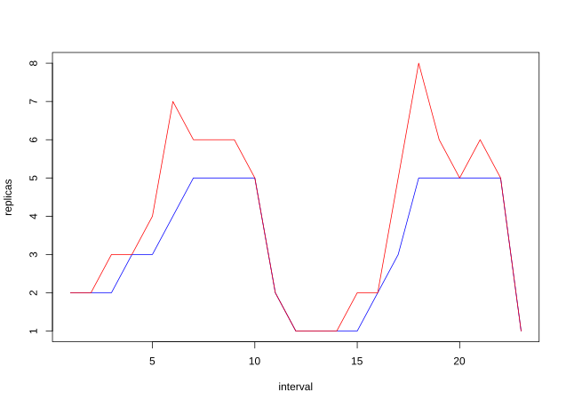

# Modeller

## Ortak Konfigürasyon

Tüm modeller şu özellikleri paylaşır:

- **type** - Modelin türü, örneğin 'Linear'.
- **name** - Modelin adı, benzersiz olmalı ve birden fazla model tarafından paylaşılmamalıdır.
- **perSyncPeriod** - Modelin değerleri yeniden hesaplama ve depolama sıklığı - temel birim olarak senkronizasyon periyoduna bağlıdır, `1` değeri her senkronizasyon periyodunda modelin yeniden hesaplanmasına, `2` değeri her iki senkronizasyon periyodunda bir yeniden hesaplanmasına, `3` her hesaplamadan sonra iki senkronizasyon periyodu beklemesine ve bu şekilde devam eder.
- **calculationTimeout** - Bir algoritma kullanarak hesaplama zaman aşımı, bu zaman aşımı aşılırsa hesaplama atlanır. Algoritmaya bağlı olarak varsayılan olarak ayarlanır, aşağıya bakın.
- **startInterval** - Modelin uygulanmaya başlaması gereken [süre](https://pkg.go.dev/time#ParseDuration). Örneğin, `1m` değeri, modelin sadece bir sonraki dakikanın başında uygulanmaya başlayacağı anlamına gelir. Bu, mevsimsel verilerin modele senkronize edilmesi gerektiğinde kullanışlıdır, örneğin Holt-Winters gibi, modelin bir Holt-Winters mevsiminin başlangıcını gece yarısı olarak tanımlamasını sağlamak ve tüm gün boyunca sürmesini sağlamak gibi.
- **resetDuration** - Modelin veri kaydetmeden geçebileceği [süre](https://pkg.go.dev/time#ParseDuration), veri çok eski olduğunda temizlenir. Bu noktada sağlanmışsa `startInterval`dan yeni bir başlangıç zamanı hesaplanacaktır.

Tüm modeller `syncPeriod` temel birimini kullanır, bu nedenle senkronizasyon periyodu `10000` (10 saniye) olarak tanımlanmışsa, modeller zamanlama ve hesaplamalarını 10 saniyenin katları olarak baz alır.

## Lineer Regresyon

Lineer regresyon modeli, varsayılan hesaplama zaman aşımı olarak `30000` (30 saniye) kullanır.

Örnek:
```yaml
models:
  - type: Linear
    name: simple-linear
    perSyncPeriod: 1
    calculationTimeout: 25000
    linear:
      lookAhead: 10000
      historySize: 6
```
Konfigürasyonun **linear** bileşeni, Lineer regresyon seçeneklerinin konfigürasyonunu yönetir:

- **lookAhead** - Modeli `10 saniye` önceden tahmin etmeye ayarlamak (milisaniye cinsinden zaman).
- **historySize** - Modeli geçmiş `6` değerlendirmeyi depolamak ve bu değerlendirmeleri tahminler için kullanmak üzere ayarlar. Eğer `> 6` değerlendirme varsa, en eski olanı kaldırılır.

Daha detaylı bir örnek için, [simple-linear örneğine](https://github.com/jthomperoo/predictive-horizontal-pod-autoscaler/tree/master/examples/simple-linear) bakın.

## Holt-Winters Zaman Serisi Tahmini

Holt-Winters zaman serisi modeli, varsayılan hesaplama zaman aşımı olarak `30000` (30 saniye) kullanır.

Örnek:
```yaml
models:
- type: HoltWinters
  name: simple-holt-winters
  perSyncPeriod: 1
  startInterval: 60s
  resetDuration: 5m
  holtWinters:
    alpha: 0.9
    beta: 0.9
    gamma: 0.9
    seasonalPeriods: 6
    storedSeasons: 4
    trend: additive
    seasonal: additive
```

Konfigürasyonun **holtWinters** bileşeni, Holt-Winters seçeneklerinin konfigürasyonunu yönetir:

- **alpha**, **beta**, **gamma** - Bunlar sırasıyla seviye, eğilim ve mevsimsellik için yumuşatma katsayılarıdır, optimize edebilmek için ayarlama ve analiz gerektirir. Daha fazla bilgi için [buraya](https://github.com/jthomperoo/holtwinters) veya [buraya](https://grisha.org/blog/2016/01/29/triple-exponential-smoothing-forecasting/) bakın.
- **seasonalPeriods** - Temel birim senkronizasyon periyotlarındaki bir mevsimin uzunluğu, örneğin senkronizasyon periyodunuz `10000` (10 saniye) ise ve tekrar eden mevsiminiz 60 saniye uzunluğunda ise, bu değer `6` olur.
- **storedSeasons** - Saklanacak mevsim sayısı, örneğin `4`, eğer `>4` mevsim saklanmışsa, en eski mevsim kaldırılacaktır.
- **trend** - `add`/`additive` veya `mul`/`multiplicative` olabilir, eğilim öğesi için yöntemi tanımlar.
- **seasonal** - `add`/`additive` veya `mul`/`multiplicative` olabilir, mevsimsel öğe için yöntemi tanımlar.

Bu modelin çalışması, `simple-holt-winters` örneğinden alınmıştır:

Kırmızı değer tahmin edilen değerlerdir, mavi değer ise gerçek değerlerdir. Buradan tahminin aşırı tahmin edildiğini, ancak yine de önceden ölçeklendirdiğini görebilirsiniz - daha fazla mevsim depolamak ve alpha, beta ve gamma değerlerini ayarlamak, aşırı tahminleri azaltacak ve daha doğru sonuçlar üretecektir.

Daha detaylı bir örnek için, [simple-holt-winters örneğine](https://github.com/jthomperoo/predictive-horizontal-pod-autoscaler/tree/master/examples/simple-holt-winters) bakın.

### Gelişmiş Ayarlama

Bu projede [statsmodels](https://www.statsmodels.org/) Python paketini kullanan Holt-Winters algoritması için daha fazla konfigürasyon seçeneği bulunmaktadır. Bunlar, [Holt-Winters Exponential Smoothing statsmodels dokümantasyonunda](https://www.statsmodels.org/dev/generated/statsmodels.tsa.holtwinters.ExponentialSmoothing.html) belgelenen ek konfigürasyon seçenekleridir - bu dokümandaki değişken isimleri burada tanımlanan camelcase isimlere eşlenir.

- **dampedTrend** - Eğilimin sönümlenip sönümlenmeyeceğini belirleyen Boolean değeri.
- **initializationMethod** - Hangi başlatma yönteminin kullanılacağını belirler, ayrıntılar için statsmodels'e bakın, `estimated`, `heuristic`, `known` veya `legacy-heuristic` olabilir.
- **initialLevel** - İlk seviye değeri, `initializationMethod` `known` ise gereklidir.
- **initialTrend** - İlk eğilim değeri, `initializationMethod` `known` ise gereklidir.
- **initialSeasonal** - İlk mevsimsel değer, `initializationMethod` `known` ise gereklidir.

### Holt-Winters Çalışma Zamanı Ayarlaması

PHPA, Holt-Winters algoritması için (`alpha`, `beta` ve `gamma`) ayarlama değerlerini dinamik olarak alma desteğine sahiptir.

Bu, bir `hook` sistemi kullanılarak yapılır, dinamik hook sisteminin nasıl çalıştığı hakkında daha fazla bilgi için [hook kullanıcı kılavuzunu](./hooks.md) ziyaret edin.

Örneğin, çalışma zamanı değerlerini almak için HTTP isteği kullanan bir hook şu şekilde yapılandırılır:

```yaml
models:
- type: HoltWinters
  name: simple-holt-winters
  perSyncPeriod: 1
  startInterval: 60s
  resetDuration: 5m
  holtWinters:
    runtimeTuningFetchHook:
      type: "http"
      timeout: 2500
      http:
        method: "GET"
        url: "http://tuning/holt_winters"
        successCodes:
          - 200
        parameterMode: body
    seasonalPeriods: 6
    storedSeasons: 4
    trend: additive
    seasonal: additive
```

> Not: Bu `parameterMode: body` kullanır, `parameterMode: query` yerine, çünkü büyük miktarda veri için oluşturulan URL çok uzun ve geçersiz hale gelebilir. Daha fazla bilgi için [#89](https://github.com/jthomperoo/predictive-horizontal-pod-autoscaler/issues/89) bakın.

Hook, `runtimeTuningFetchHook` adıyla tanımlanmıştır.

PHPA için desteklenen hook türleri şunlardır:

- HTTP istekleri

Süreç şu şekildedir:

1. PHPA, Holt-Winters hesaplamasına başlar.
2. Değerler başlangıçta konfigürasyonda belirtilen sabit değerler

 olarak ayarlanır.
3. Bir çalışma zamanı ayarlama konfigürasyonu sağlanmışsa, bu konfigürasyonu kullanarak bir hook çalıştırılır (örneğin, bir HTTP isteği gönderilir).
  - Bu hook, JSON'da girdi verileri olarak mevcut modeli ve zaman damgalı önceki ölçeklendirme kararlarından oluşan bir dizi (bu değerlere `evaluations` denir, [istek formatına bakın](#request-format)) içerecektir.
  - Yanıt, beklenen JSON yapısına uygun olmalıdır ([yanıt formatına bakın](#response-format)).
4. Hook yürütme başarılı olursa ve yanıt geçerliyse, ayarlama değerleri çıkarılır ve sağlanan değerler sabit değerlerin yerini alır.
5. Gerekli tüm ayarlama değerleri sağlanırsa, ayarlama değerleri hesaplama için kullanılır.

Ayarlama değerleri hem sabitlenmiş hem de çalışma zamanında alınabilir, örneğin `alpha` değeri çalışma zamanında hesaplanabilir ve `beta` ve `gamma` değerleri konfigürasyonda sabitlenmiş olabilir:

```yaml
models:
- type: HoltWinters
  name: simple-holt-winters
  perSyncPeriod: 1
  holtWinters:
    runtimeTuningFetchHook:
      type: "http"
      timeout: 2500
      http:
        method: "GET"
        url: "http://tuning/holt_winters"
        successCodes:
          - 200
        parameterMode: body
    beta: 0.9
    gamma: 0.9
    seasonalPeriods: 6
    storedSeasons: 4
    trend: additive
    seasonal: additive
```

Veya değerler sağlanabilir ve dış kaynak tarafından döndürülmezse, sabitlenmiş değerler yedek olarak kullanılabilir:

```yaml
models:
- type: HoltWinters
  name: simple-holt-winters
  perSyncPeriod: 1
  holtWinters:
    runtimeTuningFetchHook:
      type: "http"
      timeout: 2500
      http:
        method: "GET"
        url: "http://tuning/holt_winters"
        successCodes:
          - 200
        parameterMode: body
    alpha: 0.9
    beta: 0.9
    gamma: 0.9
    seasonalPeriods: 6
    storedSeasons: 4
    trend: additive
    seasonal: additive
```

Herhangi bir değer eksikse, PHPA bunu bir hata olarak raporlar (örneğin, `Holt-Winters tahmini için alpha ayarlama değeri sağlanmadı`) ve hesaplama ve ölçeklendirme yapmaz.

#### İstek Formatı

Dış kaynağın alacağı veri şu şekilde formatlanır:

```json
{
  "model": {
    "type": "HoltWinters",
    "name": "HoltWintersPrediction",
    "perInterval": 1,
    "linear": null,
    "holtWinters": {
      "alpha": null,
      "beta": null,
      "gamma": null,
      "runtimeTuningFetchHook": {
        "type": "http",
        "timeout": 2500,
        "shell": null,
        "http": {
          "method": "GET",
          "url": "http://tuning/holt_winters",
          "successCodes": [
            200
          ],
          "parameterMode": "body"
        }
      },
      "seasonalPeriods": 6,
      "storedSeasons": 4,
      "trend": "additive"
    }
  },
  "replicaHistory": [
    {
      "time": "2020-10-19T19:12:20Z",
      "replicas": 0
    },
    {
      "time": "2020-10-19T19:12:40Z",
      "replicas": 0
    },
    {
      "time": "2020-10-19T19:13:00Z",
      "replicas": 0
    }
  ]
}
```

Bu, kullanılan model, nasıl yapılandırıldığı ve önceki replika değerleri (`replicaHistory`) hakkında bilgi sağlar. Bu veri, ayarlama değerlerini hesaplamaya yardımcı olmak için kullanılabilir veya görmezden gelinebilir.

#### Yanıt Formatı

Dış ayarlama kaynağının döndürmesi gereken yanıt JSON formatında ve aşağıdaki yapıda olmalıdır:

```json
{
  "alpha": <alpha_değeri>,
  "beta": <beta_değeri>,
  "gamma": <gamma_değeri>
}
```

Bu basit bir JSON yapısıdır, örneğin:

```json
{
  "alpha": 0.9,
  "beta": 0.6,
  "gamma": 0.8
}
```

Bu değerlerin her biri isteğe bağlıdır, örneğin sadece `alpha` ve `beta` runtime olmalı ve `gamma` sabitlenmiş konfigürasyon değerine dayanmalıysa, bu yanıt geçerli olacaktır:

```json
{
  "alpha": 0.9,
  "beta": 0.6
}
```

Daha detaylı bir örnek için, [dynamic-holt-winters örneğine](https://github.com/jthomperoo/predictive-horizontal-pod-autoscaler/tree/master/examples/dynamic-holt-winters) bakın.