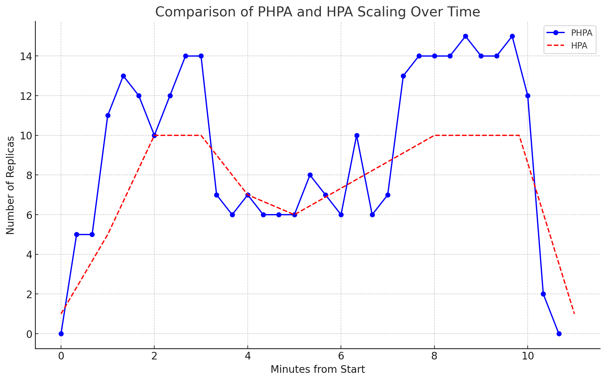

### Predictive Horizontal Pod Autoscaler (PHPA) Kullanarak Dinamik Holt-Winters

## Dinamik Holt-Winters PHPA İçin Detaylı Yük Testi

### Giriş

Bu belge, Dinamik Holt-Winters Predictive Horizontal Pod Autoscaler (PHPA) kullanarak gerçekleştirilen yük test senaryosunun detaylı açıklamasını sağlar ve bunu standart Horizontal Pod Autoscaler (HPA) ile karşılaştırır. Amacımız, PHPA'nın performansını ve ölçeklendirme davranışını değişken yük koşulları altında değerlendirmektir.

### Test Kurulumu

#### Yük Test Edici İçin Dockerfile

Yük test edici ortamını kurmak için bir `Dockerfile` oluşturun:

```Dockerfile
FROM alpine:3.6

RUN apk add --no-cache wget coreutils

COPY load_tester.sh /load_tester.sh

RUN chmod +x /load_tester.sh

CMD [ "/bin/sh", "/load_tester.sh" ]
```

#### Yük Test Edici Betiği

### Test Senaryosu: Dinamik Yük Artışı ve Azalışı

Bu test senaryosu, dinamik yük artışı ve azalışını simüle eden bir yük test betiği (`load_tester.sh`) kullanarak, Predictive Horizontal Pod Autoscaler (PHPA) ve standart Horizontal Pod Autoscaler (HPA) performansını değerlendirmektedir. Test senaryosu, belirli bir süre boyunca değişken bir yük oluşturur ve bu yükü uygulamaya göndererek ölçeklendirme davranışlarını gözlemler.

#### Test Betiği: `load_tester.sh`

Aşağıda, test betiği `load_tester.sh`'nin detaylı açıklaması bulunmaktadır:

```sh
#!/bin/sh
increment=1            # Her döngü arasında 1 dakika bekleme süresi.
total_duration=10      # Toplam test süresi 10 dakika.
start_time=$(date +%s) # Başlangıç zamanını kaydet.

# Dinamik yük artışı ve azalışı simülasyonu
i=0
while true; do
    # Geçen süreyi hesapla
    current_time=$(date +%s)
    elapsed=$(((current_time - start_time) / 60)) # Dakika cinsinden geçen süre

    if [ $elapsed -ge $total_duration ]; then
        echo "Test süresi doldu: Toplam süre ${elapsed} dakika."
        break
    fi

    # Yük hesaplaması: Testin başında ve sonunda yüksek, ortada düşük
    if [ $elapsed -lt 3 ];then
        count=40 # İlk 3 dakikada yüksek yük
    elif [ $elapsed -lt 7 ]; then
        count=10 # 4 dakika boyunca yükü düşük tut
    else
        count=40 # Son 3 dakikada yüksek yük
    fi

    echo "${elapsed} dakika: Gönderilen paralel istek sayısı: $count"
    j=1
    while [ $j -le $count ]; do
        timeout 60 wget -q -O- http://php-apache &
        j=$(expr $j + 1)
    done
    wait
    sleep $increment
done
```

#### Betiğin Çalışma Mantığı

1. **Başlangıç Ayarları**:
    - `increment=1`: Her döngü arasında 1 dakika bekleme süresi.
    - `total_duration=10`: Toplam test süresi 10 dakika.
    - `start_time=$(date +%s)`: Testin başlangıç zamanını kaydeder.

2. **Döngü Başlangıcı**:
    - `i=0`: Döngü sayacı başlatılır.
    - `while true; do`: Sonsuz döngü başlatılır. Bu döngü, test süresi dolana kadar çalışır.

3. **Geçen Süre Hesaplama**:
    - `current_time=$(date +%s)`: Şu anki zaman kaydedilir.
    - `elapsed=$(((current_time - start_time) / 60))`: Başlangıç zamanından itibaren geçen süre dakika cinsinden hesaplanır.

4. **Test Süresinin Kontrolü**:
    - `if [ $elapsed -ge $total_duration ]; then`: Geçen süre toplam test süresine eşit veya daha fazla ise:
        - Test süresinin dolduğu ve toplam sürenin ne kadar olduğu yazdırılır.
        - `break`: Döngüden çıkılır.

5. **Yük Hesaplaması**:
    - `if [ $elapsed -lt 3 ]; then`: Eğer geçen süre 3 dakikadan az ise:
        - `count=40`: İlk 3 dakika boyunca yüksek yük (40 paralel istek).
    - `elif [ $elapsed -lt 7 ]; then`: Eğer geçen süre 7 dakikadan az ise:
        - `count=10`: 4 dakika boyunca düşük yük (10 paralel istek).
    - `else`: Eğer geçen süre 7 dakika veya daha fazla ise:
        - `count=40`: Son 3 dakika boyunca yüksek yük (40 paralel istek).

6. **Paralel İstek Gönderme**:
    - `echo "${elapsed} dakika: Gönderilen paralel istek sayısı: $count"`: Mevcut dakikayı ve gönderilen paralel istek sayısını yazdırır.
    - `j=1`: İç döngü sayacı başlatılır.
    - `while [ $j -le $count ]; do`: `count` değeri kadar paralel istek gönderilir.
        - `timeout 60 wget -q -O- http://php-apache &`: `wget` komutuyla `php-apache` servisine 60 saniye boyunca paralel istek gönderilir.
        - `j=$(expr $j + 1)`: İç döngü sayacı artırılır.
    - `wait`: Tüm paralel isteklerin tamamlanmasını bekler.
    - `sleep $increment`: Bir sonraki döngüye geçmeden önce 1 dakika bekler.

7. **Döngü Sayacının Artırılması**:
    - Döngü sayacı artırılır ve süreç tekrarlanır.

Bu betik, belirlenen süre boyunca değişken yük koşullarını simüle ederek, PHPA ve HPA'nın bu yük değişimlerine nasıl tepki verdiğini gözlemlemeyi sağlar. Testin başında ve sonunda yüksek yük, ortasında ise düşük yük uygulanarak, autoscaler'ların bu değişimlere nasıl uyum sağladığı incelenir.

#### Yük Test Edici İçin Kubernetes Job

Yük test ediciyi çalıştırmak için bir Kubernetes job tanımlayın `load_job.yaml`:

```yaml
apiVersion: batch/v1
kind: Job
metadata:
  name: load-tester
spec:
  template:
    spec:
      containers:
      - name: load-tester
        image: load-tester
        imagePullPolicy: IfNotPresent
      restartPolicy: Never
  backoffLimit: 0  # Ensures the job does not retry on failure
```

### Tuning API Kurulumu

#### Tuning API İçin Dockerfile

Tuning API için bir `Dockerfile` oluşturun:

```Dockerfile
FROM python:3.8-slim
# We copy just the requirements.txt first to leverage Docker cache
COPY ./requirements.txt /app/requirements.txt
WORKDIR /app
# Install dependencies
RUN pip install -r requirements.txt
# Copy in source files
COPY . /app
ENTRYPOINT [ "python" ]
CMD [ "api.py" ]
```

#### Tuning API Betiği

Tuning API'yi tanımlamak için bir `api.py` dosyası oluşturun:

```python
from flask import Flask, request
import json

app = Flask(__name__)

ALPHA_VALUE = 0.9
BETA_VALUE = 0.9
GAMMA_VALUE = 0.9

@app.route("/holt_winters")
def metric():
    app.logger.info('Received context: %s', request.data)

    return json.dumps({
        "alpha": ALPHA_VALUE,
        "beta": BETA_VALUE,
        "gamma": GAMMA_VALUE,
    })

if __name__ == "__main__":
    app.run(debug=True, host="0.0.0.0")
```

#### Tuning API İçin Gereksinimler Dosyası

Tuning API için bağımlılıkları belirtmek üzere bir `requirements.txt` dosyası oluşturun:

```
Flask==2.3.2
```

#### Tuning API İçin Kubernetes Deployment

Tuning API'yi Kubernetes üzerinde dağıtmak için bir `tuning.yaml` dosyası oluşturun:

```yaml
apiVersion: apps/v1
kind: Deployment
metadata:
  labels:
    run: tuning
  name: tuning
spec:
  replicas: 1
  selector:
    matchLabels:
      run: tuning
  strategy:
    rollingUpdate:
      maxSurge: 25%
      maxUnavailable: 25%
    type: RollingUpdate
  template:
    metadata:
      labels:
        run: tuning
    spec:
      containers:
      - image: tuning
        imagePullPolicy: IfNotPresent
        name: tuning
        ports:
        - containerPort: 5000
          protocol: TCP
        resources:
          limits:
            cpu: 500m
          requests:
            cpu: 200m
      restartPolicy: Always
---
apiVersion: v1
kind: Service
metadata:
  name: tuning
spec:
  ports:
  - port: 80
    protocol

: TCP
    targetPort: 5000
  selector:
    run: tuning
  sessionAffinity: None
  type: ClusterIP
```

### Test Adımları

1. **Yük Test Ediciyi Kurun ve Dağıtın**:
   - Docker imajını oluşturun:
     ```bash
     docker build -t load-tester .
     ```
   - Kubernetes job'ını uygulayın:
     ```bash
     kubectl apply -f load_job.yaml
     ```

2. **Tuning API'yi Kurun ve Dağıtın**:
   - Tuning API için Docker imajını oluşturun:
     ```bash
     docker build -t tuning .
     ```
   - Tuning API için Kubernetes deployment'ını uygulayın:
     ```bash
     kubectl apply -f tuning.yaml
     ```

3. **Ölçeklendirmeyi İzleyin**:
   - PHPA'nın ölçeklendirme davranışını izlemek için şu komutu kullanın:
     ```bash
     kubectl get configmap predictive-horizontal-pod-autoscaler-dynamic-holt-winters-data -o=json | jq -r '.data.data | fromjson | .modelHistories["HoltWintersPrediction"].replicaHistory[] | .time,.replicas'
     ```

### Sonuçların Analizi

PHPA'nın Dinamik Holt-Winters modeline karşı standart HPA'nın ölçeklendirme davranışını, zaman içinde replika sayısını analiz ederek karşılaştırın. Sonuçları aşağıdaki grafikte görebilirsiniz:




### Avantajlar:

1. **Daha İyi Tahminleme**: Dynamic Holt-Winters modeli, trend ve mevsimsellik gibi zaman serisi özelliklerini dikkate alır, bu da yük değişimlerini daha doğru tahmin etmeye yardımcı olur.
2. **Önceden Ölçeklendirme**: Beklenen yük artışlarına karşı önceden ölçeklendirme yaparak, kaynakların zamanında hazır olmasını sağlar, böylece kullanıcı deneyimi iyileştirilir.
3. **Kaynak Kullanımı Optimizasyonu**: Gelecek yük tahminlerine dayalı ölçeklendirme, kaynak israfını azaltır ve maliyet optimizasyonuna katkıda bulunur.
4. **Yük Dalgalanmalarına Uyum**: PHPA, yük dalgalanmalarını öğrenerek ve tahmin ederek ani yük değişimlerine daha hızlı ve etkin yanıt verir.
5. **Esneklik**: Farklı yük senaryolarına ve iş yükü paternlerine esnek bir şekilde adapte olabilir, bu da çeşitli uygulama türleri için uygun hale getirir.

### Dezavantajlar:

1. **Karmaşıklık**: Modelin kurulumu ve ayarı, standart HPA'ya göre daha karmaşık ve teknik bilgi gerektirir.
2. **Yanlış Tahminler**: Model parametrelerinin yanlış ayarlanması, tahmin hatalarına ve istenmeyen ölçeklendirme eylemlerine yol açabilir.
3. **Bakım Gereksinimi**: Modelin doğru çalışmaya devam etmesi için düzenli bakım ve inceleme gereklidir.
4. **Veriye Duyarlılık**: Yeterli ve kaliteli veri gerektirir; veri eksikliği veya kalitesiz veri model performansını olumsuz etkileyebilir.
5. **Maliyet**: İleri düzey modelleme ve sürekli veri analizi, işletme maliyetlerini artırabilir.

### Normal Horizontal Pod Autoscaler (HPA)

### Avantajlar:

1. **Kurulum Kolaylığı**: HPA, Kubernetes'in yerleşik bir özelliği olarak gelir ve basit metriklerle kolayca kurulabilir ve yönetilebilir.
2. **Düşük Bakım**: Bir kez kurulduktan sonra, az bakım gerektirir ve genellikle otomatik olarak çalışır.
3. **Anında Tepki**: Gerçek zamanlı metriklerle çalışır ve kaynak kullanımı belirli bir eşiği aştığında hızlı bir şekilde ölçeklendirme yapar.
4. **Geniş Kabul ve Destek**: Kubernetes kullanıcıları arasında geniş bir kabul görmüştür ve çeşitli araçlar ve topluluk desteği ile desteklenmektedir.
5. **Basit ve Güvenilir**: Yapılandırması kolaydır ve çoğu kullanım senaryosu için güvenilir sonuçlar sunar.

### Dezavantajlar:

1. **Reaktif Yaklaşım**: Yalnızca mevcut yük üzerine tepki verir, bu yüzden yük artışlarına proaktif bir yanıt veremez.
2. **Esneklik Eksikliği**: Mevsimsellik veya trend gibi daha karmaşık yük desenlerini anlamakta ve buna göre ölçeklendirmede yetersiz kalabilir.
3. **Ani Yük Değişimlerine Yavaş Yanıt**: Ani yük artışları durumunda, kaynaklar yeterince hızlı sağlanamayabilir, bu da performans sorunlarına yol açabilir.
4. **Kaynak İsrafı**: Kısa süreli yük artışları, gereksiz yere fazla sayıda pod başlatılmasına neden olabilir.
5. **Detaylı İzleme ve Tahmin Yok**: HPA, basit CPU ve bellek kullanımı gibi temel metriklerle çalışır ve daha detaylı kullanım veya tahmin yetenekleri sunmaz.


### Sonuç

Bu test senaryosu, Dynamic Holt-Winters PHPA'nın değişken yük koşullarına nasıl uyum sağladığını ve standart HPA ile karşılaştırıldığında performansını göstermektedir. Her iki yaklaşımın avantajlarını ve dezavantajlarını anlayarak, uygulama ihtiyaçlarınıza en uygun otomatik ölçeklendirme yöntemini seçebilirsiniz.