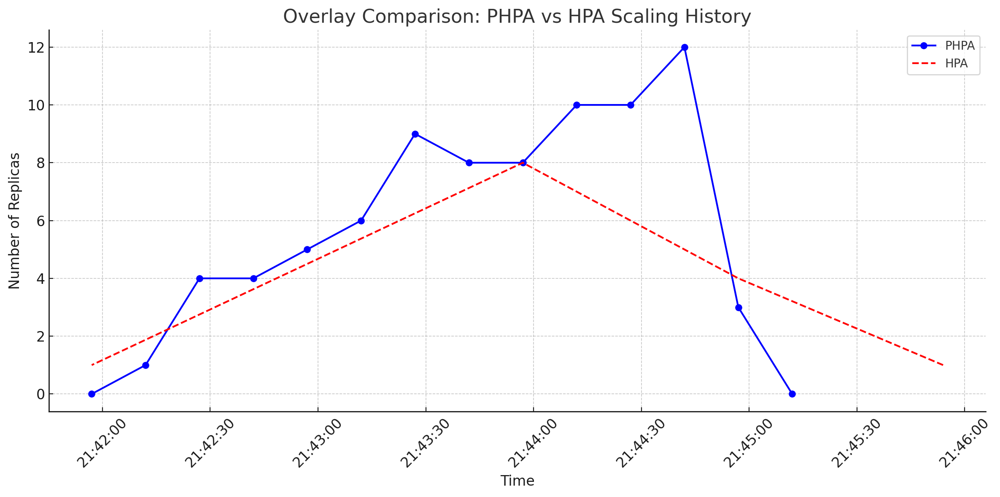

# Basit Lineer Regresyon Kullanan Predictive Horizontal Pod Autoscaler (PHPA) İçin Yük Testi ve Karşılaştırma

## Giriş

Bu belge, Predictive Horizontal Pod Autoscaler (PHPA) kullanarak basit bir lineer regresyon modeliyle performansını değerlendirmek için ayrıntılı bir test senaryosu sunar. Amacımız, değişken yük koşulları altında standart bir Horizontal Pod Autoscaler (HPA) ile ölçekleme davranışını ve etkinliğini karşılaştırmaktır.

## Ön Koşullar

Teste başlamadan önce, aşağıdaki araçların yüklü ve yapılandırılmış olduğundan emin olun:

- **Docker**: Yük testi imajını oluşturmak için.
- **kubectl**: Kubernetes kümenizle etkileşim kurmak için.
- **Helm**: PHPA operatörünü kurmak için.
- **jq**: Kubernetes'ten JSON çıktısını ayrıştırmak için.

Kubernetes kümenizin çalışır durumda olduğundan ve uygulamaları dağıtmak ve otomatik ölçeklendirme işlemlerini gerçekleştirmek için gerekli izinlere sahip olduğunuzdan emin olun.

## Test Kurulumu

### Yük Testi İçin Dockerfile

Öncelikle, test uygulamasına HTTP istekleri gönderecek yük testi için bir Docker imajı oluşturun.

```dockerfile
FROM alpine:3.6

RUN apk add --no-cache wget coreutils

COPY load_tester.sh /load_tester.sh
RUN chmod +x /load_tester.sh

CMD [ "/bin/sh", "/load_tester.sh" ]
```


#### Test Betiği: `load_tester.sh`

Aşağıda, `load_tester.sh` betiğinin detaylı açıklaması bulunmaktadır:

```sh
#!/bin/sh
increment=5
i=1
while [ $i -le 20 ]; do
    count=$(expr $i \* 5) # Aritmetik işlemler için `expr` kullanımı uyumluluk için
    echo "Gönderilen paralel istek sayısı: $count"
    j=1
    while [ $j -le $count ]; do
        timeout 60 wget -q -O- http://php-apache &
        j=$(expr $j + 1) # Burada da `expr` kullanımı
    done
    wait
    sleep $increment
    i=$(expr $i + 1)
done
```

#### Betiğin Çalışma Mantığı

1. **Başlangıç Ayarları**:
    - `increment=5`: Her döngü arasında 5 dakika bekleme süresi.
    - `i=1`: Döngü sayacını başlatır.

2. **Döngü Başlangıcı**:
    - `while [ $i -le 20 ]; do`: Döngü sayacı 20'ye ulaşana kadar döngüyü çalıştırır.

3. **Paralel İstek Sayısının Hesaplanması**:
    - `count=$(expr $i \* 5)`: Döngü sayısını 5 ile çarparak gönderilecek paralel istek sayısını belirler.
    - `echo "Gönderilen paralel istek sayısı: $count"`: Mevcut döngüde gönderilecek paralel istek sayısını yazdırır.

4. **Paralel İstek Gönderme**:
    - `j=1`: İç döngü sayacını başlatır.
    - `while [ $j -le $count ]; do`: `count` değeri kadar paralel istek gönderir.
        - `timeout 60 wget -q -O- http://php-apache &`: `wget` komutuyla `php-apache` servisine 60 saniye boyunca paralel istek gönderir.
        - `j=$(expr $j + 1)`: İç döngü sayacını artırır.
    - `wait`: Tüm paralel isteklerin tamamlanmasını bekler.
    - `sleep $increment`: Bir sonraki döngüye geçmeden önce 5 dakika bekler.

5. **Döngü Sayacının Artırılması**:
    - `i=$(expr $i + 1)`: Döngü sayacını artırır ve süreç tekrarlanır.

Bu betik, toplamda 20 döngü boyunca artan sayıda paralel HTTP istekleri göndererek uygulamaya yük bindirir. İlk döngüde 5 istek, ikinci döngüde 10 istek ve bu şekilde devam ederek son döngüde 100 istek gönderir. Her döngü arasında 5 dakika beklenir. Bu sayede, PHPA ve HPA'nın artan yük karşısında nasıl tepki verdiği gözlemlenebilir.

### Yük Testi İçin Kubernetes Job

Yük testi scriptini çalıştırmak için bir Kubernetes Job tanımlayın.

```yaml
apiVersion: batch/v1
kind: Job
metadata:
  name: load-tester
spec:
  template:
    spec:
      containers:
      - name: load-tester
        image: load-tester
        imagePullPolicy: IfNotPresent
      restartPolicy: Never
  backoffLimit: 0  # Job başarısız olursa yeniden denememesi için
```

## Test Uygulamasını Dağıtma

PHPA tarafından ölçeklenecek örnek bir uygulama dağıtın.

### Dağıtım ve Servis Tanımı

Örnek uygulama için Deployment ve Service tanımlamak üzere `deployment.yaml` dosyasını oluşturun.

```yaml
apiVersion: apps/v1
kind: Deployment
metadata:
  labels:
    run: php-apache
  name: php-apache
spec:
  replicas: 1
  selector:
    matchLabels:
      run: php-apache
  template:
    metadata:
      labels:
        run: php-apache
    spec:
      containers:
      - image: k8s.gcr.io/hpa-example
        imagePullPolicy: Always
        name: php-apache
        ports:
        - containerPort: 80
          protocol: TCP
        resources:
          limits:
            cpu: 500m
          requests:
            cpu: 200m
      restartPolicy: Always
---
apiVersion: v1
kind: Service
metadata:
  name: php-apache
  namespace: default
spec:
  ports:
  - port: 80
    protocol: TCP
    targetPort: 80
  selector:
    run: php-apache
  sessionAffinity: None
  type: ClusterIP
```

Deployment ve Service'i uygulayın:

```bash
kubectl apply -f deployment.yaml
```

## PHPA Operatörünü Kurma

Predictive Horizontal Pod Autoscaler operatörünü Helm kullanarak kurun.

```bash
VERSION=v0.13.2
HELM_CHART=predictive-horizontal-pod-autoscaler-operator
helm install ${HELM_CHART} https://github.com/jthomperoo/predictive-horizontal-pod-autoscaler/releases/download/${VERSION}/predictive-horizontal-pod-autoscaler-${VERSION}.tgz
```

## PHPA'yı Yapılandırma

Basit bir lineer regresyon modeli ile Predictive Horizontal Pod Autoscaler'ı tanımlamak için `phpa.yaml` dosyasını oluşturun.

```yaml
apiVersion: jamiethompson.me/v1alpha1
kind: PredictiveHorizontalPodAutoscaler
metadata:
  name: simple-linear
spec:
  scaleTargetRef:
    apiVersion: apps/v1
    kind: Deployment
    name: php-apache
  minReplicas: 1
  maxReplicas: 10
  behavior:
    scaleDown:
      stabilizationWindowSeconds: 0
  metrics:
    - type: Resource
      resource:
        name: cpu
        target:
          averageUtilization: 50
          type: Utilization
  models:
    - type: Linear
      name: simple-linear
      perSyncPeriod: 1
      linear:
        lookAhead: 10000
        historySize: 6
  decisionType: "maximum"
  syncPeriod: 10000
```

PHPA konfigürasyonunu uygulayın:

```bash
kubectl apply -f phpa.yaml
```

## Yük Testini Çalıştırma

### Yük Testini Başlatma

Yük testi için Docker imajını oluşturun ve push edin:

```bash
docker build -t load-tester .
docker tag load-tester <your-docker-repo>/load-tester
docker push <your-docker-repo>/load-tester
```

`load_job.yaml` dosyasını Docker repository'nizle güncelleyin ve uygulayın:

```bash
kubectl apply -f load_job.yaml
```

### Ölçekleme Davranışını İzleme

PHPA operatör günlüklerini izleyin:

```bash
kubectl logs -l name=predictive-horizontal-pod-autoscaler -f
```

PHPA tarafından alınan ölçeklendirme kararlarını kontrol edin:

```bash
kubectl get configmap predictive-horizontal-pod-autoscaler-simple-linear-data -o=json | jq -r '.data.data | fromjson | .modelHistories["simple-linear"].replicaHistory[] | .time,.replicas'
```



## PHPA ve HPA'yı Karşılaştırma

### PHPA'nın Avantajları

1. **Proaktif Ölçeklendirme**: PHPA, gelecekteki yük tahminlerine dayanarak önceden ölçeklendirme yapabilir, bu da ani yük artışlarına daha hızlı tepki verilmesini sağlar.
2. **Kaynak Optimizasyonu**: Yeterli kaynakların her zaman mevcut olmasını sağlayarak ve aşırı provizyonu önleyerek kaynak kullanımını daha verimli hale getirir.
3. **Daha İyi Kullanıcı Deneyimi**: Kullanıcı talebi artışlarına hızlı yanıt verme yeteneği, kullanıcı deneyimini iyileştirir ve sistem yavaşlamalarını veya kesintilerini minimize eder.
4. **Esneklik**: Farklı senaryolara ve beklenmedik yük değişimlerine karşı daha esnek bir ölçeklendirme stratejisi sunar.
5. **Analitik Yaklaşım**: Veriye dayalı tahminlerle, sistem performansını daha iyi anlama ve sürekli iyileştirmeler yapma imkanı sunar.

### PHPA'nın Dezavantajları

1. **Karmaşıklık**: Tahmin modellerini kurmak ve ayarlamak daha karmaşık ve zaman alıcı olabilir.
2. **Hata Riski**: Yanlış tahminler, gereksiz ölçeklendirme eylemlerine neden olabilir ve maliyetleri artırabilir.
3. **Bakım Gereksinimi**: Modelin düzenli olarak güncellenmesi ve doğru çalışması için sürekli bakım gerektirir.
4. **Veri Bağımlılığı**: Doğru çalışması için yüksek kaliteli ve sürekli veri akışına ihtiyaç duyar.
5. **Maliyet**: Tahmin modelinin geliştirilmesi ve işletilmesi ek maliyetler getirebilir.

### HPA'nın Avantajları

1. **Basitlik ve Kolaylık**: HPA, CPU ve bellek kullanımı gibi metrikler üzerinden otomatik olarak ölçeklendirme yapar ve kurulumu görece daha basittir.
2. **Geniş Kabul ve Destek**: Kubernetes topluluğu tarafından yaygın olarak kabul görmüş ve iyi anlaşılmış bir çözümdür.
3. **Düşük Bakım Gereksinimi**

: PHPA'ya kıyasla daha az bakım ve yönetim gerektirir.
4. **Anında Tepki**: Gerçek zamanlı metrikler üzerinden çalıştığı için, sistem anında mevcut yüke göre ölçeklendirme yapabilir.
5. **Uyumluluk ve Entegrasyon**: Çeşitli Kubernetes çevrelerinde ve ekosistem araçlarıyla entegre çalışabilme yeteneği.

### HPA'nın Dezavantajları

1. **Reaktif Yaklaşım**: Yalnızca mevcut metrikler üzerinden ölçeklendirme yapar, bu yüzden ani yük artışlarına yavaş tepki verebilir.
2. **Sistem Dalgalanmaları**: Yüksek yük altında sistemin yavaşlamasına neden olabilir, çünkü kaynaklar yeterince hızlı sağlanamayabilir.
3. **Aşırı Ölçeklendirme Riski**: Kısa süreli yük artışları bazen gereğinden fazla pod başlatılmasına neden olabilir, bu da kaynak israfına yol açar.
4. **Sınırlı Esneklik**: Önceden belirlenmiş eşikler dışında daha karmaşık yük modellerine uyum sağlamada sınırlıdır.
5. **Maliyet Optimizasyonu**: Ani düşüşlerde hızlı ölçek küçültme yapmazsa, gereksiz maliyet artışına neden olabilir.

## Sonuç

Bu yük test senaryosu, Predictive Horizontal Pod Autoscaler (PHPA) kullanarak basit lineer regresyon modeli ile standart Horizontal Pod Autoscaler (HPA) arasında kapsamlı bir karşılaştırma sağlar. Değişken yük koşulları altında ölçekleme davranışlarını değerlendirerek, her iki yaklaşımın avantajları ve dezavantajları hakkında bilgi sahibi olabilir ve belirli kullanım senaryoları için en uygun otomatik ölçeklendirme stratejisini belirlememize yardımcı olur.